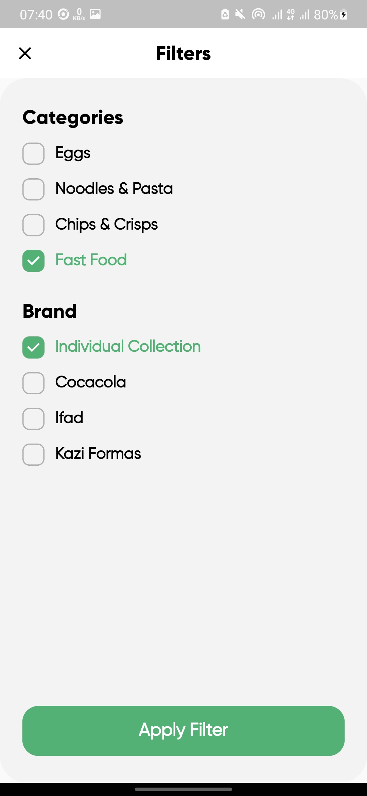
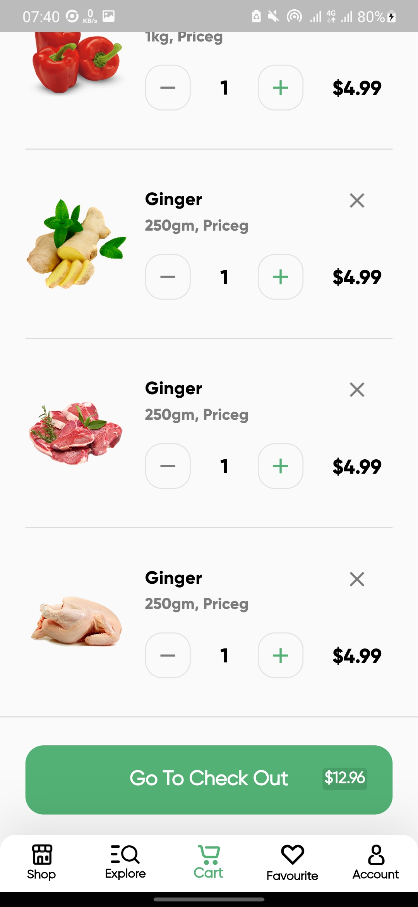

Flutter Grocery App 
-------------   
-------------  

## Screenshots  

 
  
  
   
  
  
   
  
  
  

-------------  

## Screens  
 
- Home Screen(Shop)  
- Product Details Screen  
- Categories Screen (Explore)  
- Products Screen (After clicking any category)
- Filter Screen  
- My Cart Screen  
- Checkout Bottom Sheet  
- Order Failed Dialog  
- Order Accepted Screen  
- Profile Screen
